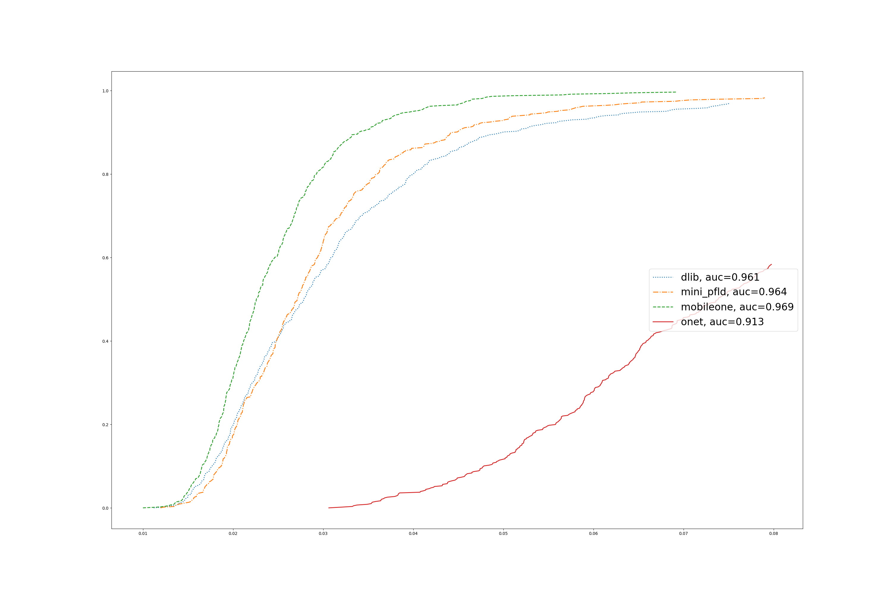

# <div align="center">Facial Landmark Detection</div>

---

## Installation
Clone the repository from GitHub. Then create a virtual environment and install all dependencies.
Below is an example for creating a virtual environment using [virtualenv](https://virtualenv.pypa.io/). 
```bash
git clone https://github.com/QwertyNice/facial_landmark_detection_vl.git
cd facial_landmark_detection_vl
mkvirtualenv fld_vl
workon fld_vl
pip install -r requirements.txt
```
You also need to install [PyTorch](https://pytorch.org/get-started/locally/), [PyTorchLightning](https://www.pytorchlightning.ai/) and [DLIB](https://github.com/davisking/dlib).

## Dataset preparation
Download [300W](https://ibug.doc.ic.ac.uk/resources/300-W/) and [Menpo](https://ibug.doc.ic.ac.uk/resources/2nd-facial-landmark-tracking-competition-menpo-ben/) datasets [here](https://drive.google.com/file/d/0B8okgV6zu3CCWlU3b3p4bmJSVUU/view?usp=sharing).  
Next, we need to prepare datasets for training and testing:
- Filter photos of only 68 points ;
- Find the coordinates of the face using [dlib script](https://github.com/davisking/dlib/blob/master/python_examples/face_detector.py);
- Check that the marked coordinates match the found face;
- Save information in `train.csv` and `test.csv`.

All of this will be done by the script below:
```bash
python data/prepare_dataset.py --path path_to_downloaded_datasets
```
This process will take some time. If you don't want to wait, then I put the annotation files [here](https://drive.google.com/drive/folders/1ktzAYGmq4iieJNEwn9GjTbjCE88aJrfJ?usp=sharing).  
The output will be 3 files: `train.csv`, `test.csv` and `empty_photos.csv`. 
The last one contains the image paths on which dlib did not detect faces at all (error_type 0) or the central point of the nose (index 33 by default) did not locate into the founded bounding box (error_type 1).

## Before training
Open the configuration file at `config` directory and fill it in.  
Notes:
- [Weights & Biases Logging](https://wandb.ai/) is used during training. If you want to disable it then put `false` in `loggin/wandb/logging`;
- Flag `logging/wandb/img_log_every` means that a picture of each `img_log_every` step will be sent to wandb. Note that during validation, `batch_size` equals 1;
- Flag `dataset/padding` is calculated as a percentage of the bounding box size.
- Flag `train/pretrained_weights` is used only for [MobileOne-S1](https://github.com/apple/ml-mobileone). Download MobileOne-S1 unfused pytorch checkpoint if you want to use pretrained weights;
- Model arch `mini_pfld` at `train/model_arch` means that [PFLD](https://arxiv.org/pdf/1902.10859.pdf) is used without auxiliary branch.

## Training
Simply run:
```bash
python train.py --cfg path_to_config_file
```
My trained weights for all three models (ONet, miniPFLD and MobileOne-S1) uploaded [here](https://drive.google.com/drive/folders/12vm-pxr37gIM_OsPRLHEzf9vcIPD7GgV?usp=sharing).

## Cumulative error distribution calculation
After training, we need to generate `.pts` files for each face in our previously generated `test.csv`:
```bash
python create_pts.py --cfg path_to_config_file --weights path_to_trained_weights --save_path path_to_save_pts_files --dataset_path path_to_dataset --dataset_type Menpo
```
Note that you can generate `.pts` files for Menpo, 300W or both datasets by setting the corresponding `dataset_type` argument.  
The points obtained as a result of the DLIB landmark detection [script](http://dlib.net/face_landmark_detection.py.html) can be downloaded [here](https://drive.google.com/drive/folders/1wZg0xl2jdOzAomg5B-4NhqeyYKETv-Hv?usp=sharing).

Then generate the plot with CED (error threshold equals 0.08) for all selected paths with `.pts` files.
```bash
python calculate_ced.py --gt_path path_to_ground_true_pts --normalization_type bbox --predictions_path path_to_pts_1 --predictions_path path_to_pts_2 --predictions_path path_to_pts_3 --output_path output_path/ced
```

## Conclusion

CED for Menpo dataset calculated by my models:
<p align="center">
  
</p>

How the best model works:
<div align="center">
	
</div>